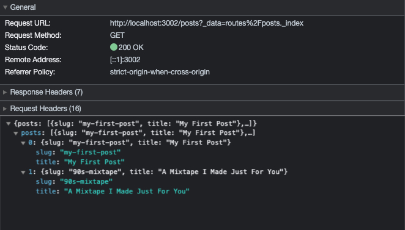
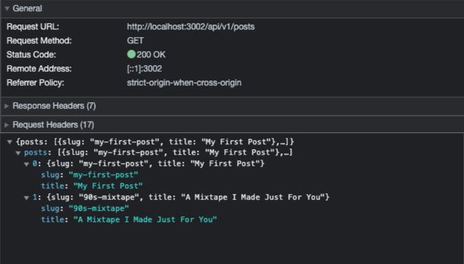

# Minimal Remix BFF Example

This minimal example shows how to use Remix as a BFF (Backend for Frontend) that allows integration with native mobile
apps. By default, Remix does not expose endpoints that are really usable for native mobile apps. This example shows how
to expose such endpoints - without having to use a separate framework - or changes to the internals of Remix.

## Run the example

From your terminal:

```sh
npm install
npm run dev
```

This starts the app in development mode, rebuilding assets on file changes.


## How does Remix work with Endpoints?
Head over to the page you just launched (usually [http://localhost:3000](http://localhost:3000)) and you'll see a page
that shows "Welcome to Remix" and a link to "/posts".

Open the Network Inspector of your browser. Then click the "/posts" link. You will see a network request where Remix
loads the data for the page. The response is JSON as Remix can render the page in the browser and does not need to
render it on the server.

We can see that Remix has issued a GET request to `/posts?_data=routes/posts._index` and has received the pure JSON as
we defined in the file `app/models/posts.server.ts`. Unfortunately this is not very useful for native applications as
we would be closely coupled to the web app.




## Solving the Problem
The `app/models/posts.server.ts` file is a very clean solution to implement a Backend for Frontend (BFF) patter and
nicely organizes the code for us. In the `app/routes/posts._index.tsx` file we can see that the data is loaded using
our model functions and provided to the React component. Again - a very clean solution.

```tsx
// File: app/models/posts.server.ts
export async function getPosts(): Promise<Array<Post>> {
    return [
        {
            slug: "my-first-post",
            title: "My First Post",
        },
        {
            slug: "90s-mixtape",
            title: "A Mixtape I Made Just For You",
        },
    ];
}

// File: app/routes/posts._index.tsx
export const loader = async () => {
    return json({ posts: await getPosts() });
};
```

In order to make the API available to a native application, we are going to use the [Resource Routes](https://remix.run/docs/en/main/guides/resource-routes)
feature available in Remix. This allows us to define a route that is not rendered in the browser, but instead exposes
an HTTP endpoint that can be used by native applications.

For this reason we are going create a new file `app/routes/api.v1.posts.tsx` that only contains the loader function and
exposes and endpoint on `/api/v1/posts`. See the full content of the file below.

```tsx
// File: app/routes/api.v1.posts.tsx
import { json } from "@remix-run/node";
import { getPosts } from "~/models/post.server";

export const loader = async () => {
    return json({ posts: await getPosts() });
};
```

In the browser we can now access the endpoint on [http://localhost:3000/api/v1/posts](http://localhost:3000/api/v1/posts).
The following picture shows that we receive the exact same JSON as before, but now we can use this endpoint in our
native application.




## Outro

Most likely we can even refactor the loader function to be used by both the web app and the native app. However this
also introduces a tight coupling between the web app and the native app.
